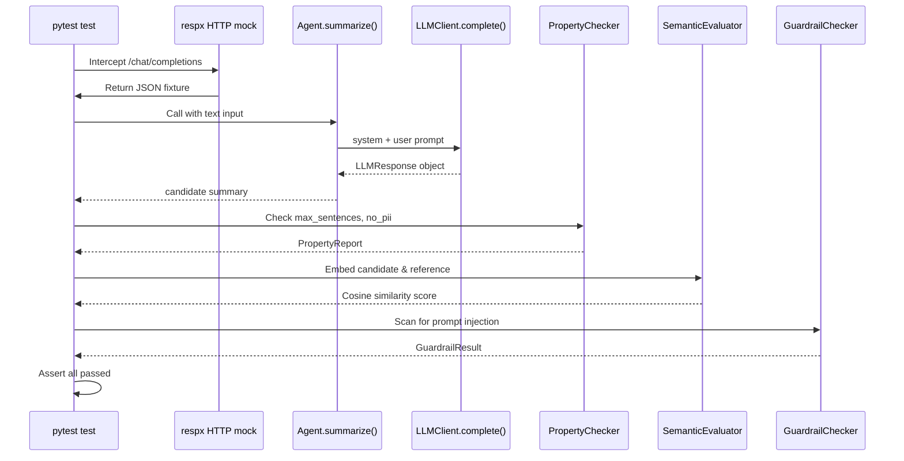

# Taming the LLM: Unit Testing for Non-Deterministic AI Agents

## Overview

Traditional software engineering relies on deterministic testing methodologies. However, the integration of Large Language Models (LLMs) introduces stochastic behavior into application pipelines. Even with temperature parameters set to zero, variations in token sampling, upstream model updates, and floating-point math across distributed GPUs render exact-match assertions (`assert output == expected`) obsolete.

This repository provides a comprehensive, multi-layered testing framework designed to evaluate and validate non-deterministic AI agents in Python. It demonstrates how to enforce rigorous quality assurance standards without relying on exact string matching.

## Architectural Methodology

The testing pipeline is constructed across four distinct evaluation layers:

```mermaid
graph TB
    subgraph "Test Input"
        T1[pytest test function]
        T2[Mock LLM Response (JSON fixture)]
    end
    
    subgraph "Layer 1: HTTP Boundary Mocking"
        L1[respx interceptor]
    end
    
    subgraph "Layer 2: Property Validation"
        L2A[JSON schema check]
        L2B[Length constraints]
        L2C[Value set membership]
        L2D[PII detection]
    end
    
    subgraph "Layer 3: Semantic Evaluation"
        L3A[Sentence Transformer<br/>all-MiniLM-L6-v2]
        L3B[Cosine similarity calculation]
        L3C[Threshold assertion]
    end
    
    subgraph "Layer 4: Guardrails"
        L4A[Prompt injection detection]
        L4B[Harmful content patterns]
        L4C[Language consistency]
    end
    
    subgraph "Test Output"
        R1[Pass/Fail result]
        R2[Similarity score report]
        R3[Security violation alert]
    end
    
    T1 --> L1;
    L1 --> T2;
    T2 --> L2A;
    T2 --> L2B;
    T2 --> L2C;
    T2 --> L2D;
    L2A --> L3A;
    L2B --> L3A;
    L2C --> L3A;
    L2D --> L3A;
    L3A --> L3B;
    L3B --> L3C;
    L3C --> L4A;
    L3C --> L4B;
    L3C --> L4C;
    L4A --> R1;
    L4B --> R1;
    L4C --> R1;
    L3C --> R2;
    L4A --> R3;
    L4B --> R3;
```
1. HTTP Boundary Mocking
Unit tests should evaluate the application logic, not the latency or variance of external APIs. This framework utilizes respx to intercept network requests at the HTTP layer, injecting deterministic JSON fixtures. This isolates the agent logic and ensures test suites remain fast and cost-free.

2. Structural Property Validation
Instead of evaluating the semantic content, this layer validates the structural integrity of the output. Utilizing hypothesis for property-based testing, the framework verifies invariants such as:

Schema adherence (e.g., valid JSON structures for entity extraction).
Bounded constraints (e.g., maximum sentence counts, token limits).
Security policies (e.g., absence of Personally Identifiable Information).
3. Semantic Similarity Evaluation
To validate the actual meaning of generated text, the framework employs dense vector embeddings. By mapping both the candidate output and a reference text into a shared latent space using sentence-transformers (all-MiniLM-L6-v2), we calculate the cosine similarity between the vectors.

The framework includes a custom pytest plugin that exposes a session-scoped semantic fixture, enabling threshold-based assertions:

```Python

def test_summarization_accuracy(semantic, agent):
    candidate = agent.summarize(text)
    semantic.assert_similar(
        candidate=candidate,
        reference="Python is a versatile language used in web development and data science.",
        threshold=0.75
    )
```
4. Production Guardrails
LLM outputs are susceptible to adversarial inputs and alignment failures. The testing suite treats security heuristics as first-class assertions, evaluating outputs against known prompt injection patterns, harmful content signatures, and unexpected linguistic shifts.

## Installation
The project requires Python 3.11 or higher. It is recommended to use an isolated virtual environment.

```Bash

python -m venv .venv
source .venv/bin/activate  # On Windows: .venv\Scripts\activate
pip install --upgrade pip setuptools wheel
pip install -e ".[dev]"
```
## Running the Test Suite
The framework includes 71 tests covering the agent logic, property checkers, semantic evaluators, and integration pipelines.


## Execute the complete test suite:

```Bash

python -m pytest tests/ -v --tb=short
```
## Execute specific test strata using pytest markers:

```Bash

# Run structural and unit tests (excludes LLM model loading)
python -m pytest tests/ -m "not slow and not integration"

# Run semantic evaluation tests
python -m pytest tests/ -m "semantic"

# Run full integration pipelines
python -m pytest tests/ -m "integration"
```

## Continuous Integration
A GitHub Actions configuration is provided in .github/workflows/ (or ci/). The pipeline is structured to fail fast:

- Static Analysis: ruff for linting and formatting, mypy for strict type checking.
- Fast Tests: Deterministic boundary and property tests.
- Integration & Semantic Tests: Evaluates embeddings (caching the HuggingFace models to minimize pipeline duration).
- Coverage Reporting: Ensures high test density across the evaluation logic.

## Project Structure
```text

├── src/
│   ├── agent.py               # Core LLM interaction logic
│   ├── client.py              # Resilient HTTP client wrapping OpenAI schema
│   ├── prompts.py             # System and user prompt templates
│   └── evaluation/
│       ├── semantic.py        # Cosine similarity via sentence-transformers
│       ├── properties.py      # Structural and deterministic constraints
│       └── guardrails.py      # Security and alignment heuristics
├── tests/                     # Test suite organized by evaluation layer
├── pytest_semantic/           # Custom pytest plugin for vector assertions
└── fixtures/                  # Deterministic API responses and test cases
```
## Research & Application
This repository was developed to accompany the presentation "Taming the LLM: Writing Unit Tests for Non-Deterministic AI Agents" for PyCon Latam 2026.

The methodologies demonstrated here are intended to bridge the gap between experimental AI development and enterprise-grade software engineering. Researchers and developers are encouraged to integrate the src/evaluation and pytest_semantic modules into their own production repositories.